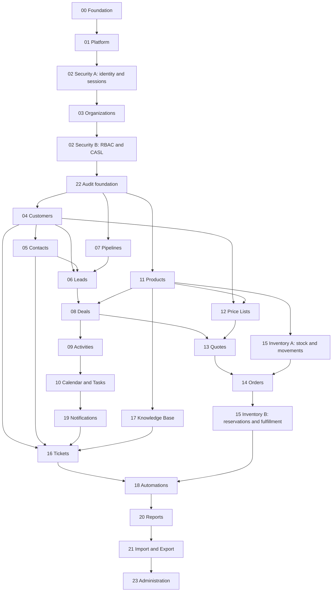

# Dependencias entre módulos

El número original identifica alcance, no orden de implementación. Este mapa
explica por qué algunos módulos se adelantan o se visitan en dos pasadas.



## Relaciones transversales

### User, organization y role

- Un `user` puede pertenecer a muchas organizaciones.
- Una `organization` tiene muchos usuarios.
- `organization_members` materializa ese muchos-a-muchos como dos relaciones
  uno-a-muchos y guarda estado, fechas y metadatos de membresía.
- Los roles se asignan al miembro, no a la identidad global, para que la misma
  persona pueda ser admin en una organización y sales representative en otra.

Security A se implementa antes de Organizations porque se necesita una identidad
para crear la primera membresía. Security B se implementa después porque el rol
organizacional necesita ambas foreign keys.

### Quote, order e inventory

- Products debe existir antes de Quotes e Inventory.
- Quote guarda intención comercial y snapshots, pero no mueve stock.
- Inventory A enseña saldos y movimientos antes de ligarlos a una venta.
- Order crea `order_items`; solo entonces Inventory B puede agregar reservas que
  apunten a un renglón específico.

La reserva no pertenece únicamente a la orden porque una orden puede tener
varios productos y un item puede surtirse desde distintas ubicaciones.

### Audit e historiales

`audit_logs` identifica quién cambió qué. Un historial de estado explica la
evolución de un agregado. No se sustituyen:

- `deal_stage_history` responde “¿cómo avanzó esta oportunidad?”.
- `audit_logs` responde “¿quién hizo el cambio, desde dónde y qué valores tocó?”.

Audit se inicia temprano para que los módulos no deban reconstruirse al final;
el módulo 22 se completa después con consultas, retención y administración.

### Notifications y automations

Notifications se construye antes de Quotes/Orders/Tickets porque esos módulos
deben producir alertas desde el inicio. Automations espera a que existan eventos
reales para enseñar outbox, idempotencia, reintentos y prevención de recursión.

## Orden del seed maestro

```text
platform reference data
→ permissions
→ users
→ organizations
→ organization members and roles
→ settings, catalogs and taxes
→ customers → contacts
→ products → price lists
→ pipelines → leads → deals
→ activities → tasks/calendar
→ notification templates
→ quotes
→ warehouses → initial movements/stocks
→ orders → reservations/fulfillments
→ knowledge base → tickets
→ automations → dashboards
```

Si un seeder requiere un registro posterior en esta lista, el diseño está
introduciendo una dependencia circular y debe revisarse antes de programarlo.
